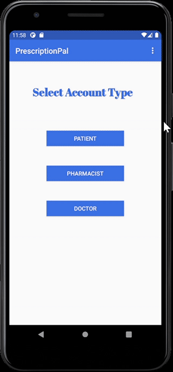

# PrescriptionPal

## Developers

- Aaron Serpa
- Alexa Kegarice
- Ashley Guan
- Kevin Viet Nguyen
- Siya Pang

## Hotlinks 
(Many of these are private, contact me or any developer if you would like to view)
- Original Github: https://github.com/SiyaPang/2021-spring-cs160-Zenith 
- Zenhub: https://app.zenhub.com/workspaces/team-zenith-60244e71ae31a10020c88897/board?repos=337856789
- Firebase: https://console.firebase.google.com/u/1/project/prescriptionpal-d1b0a/overview  

## Description

- PrescriptionPal is an application where customers, doctors, or pharmacies may use to keep track of a patient's prescription and medication in general.
- This application stores its information into its own database through [Google's Firestore](https://cloud.google.com/firestore)
- Customers may use this application to easily add prescripitions through their phone so that pharmacies are able to fill/refill for them any time.
- Pharmacies may use this application to retrieve prescriptions from customers or doctors so that they can properly fill/refill the medication and deliver them to the customer.
- Doctors may use this application to keep track of their patients and check up on them to see if they are properly taking their medication.

## Important File Info

- [**Sign-up**](https://github.com/kevinvietnguyen/PrescriptionPalCS160/blob/main/app/src/main/java/edu/sjsu/android/prescriptionpal/Signup.java) :
  - Allows users of any occupations to register an account into PrescriptionPal
  - Requires user to input their first and last name, their password, and their email
  - Once the user has registered, they are able to log-in which is allowed by the [**Login file**](https://github.com/kevinvietnguyen/PrescriptionPalCS160/blob/main/app/src/main/java/edu/sjsu/android/prescriptionpal/Login.java)
- [**SingleAccountSignup**](https://github.com/kevinvietnguyen/PrescriptionPalCS160/blob/main/app/src/main/java/edu/sjsu/android/prescriptionpal/SingleAccountSignup.java) :
  - Allows patients to create a patient account into PrescriptionPal
  - Requires the patient to input information such as their address, contact information, preferred pharmacy, and more
  - If the user would like to register an additional patient to their account, the [**additional_patient file**](https://github.com/kevinvietnguyen/PrescriptionPalCS160/blob/main/app/src/main/java/edu/sjsu/android/prescriptionpal/additional_patient.java) allows them to fill out an additional form to connect their loved ones to their account
- [**PatientHomePage**](https://github.com/kevinvietnguyen/PrescriptionPalCS160/blob/main/app/src/main/java/edu/sjsu/android/prescriptionpal/PatientHomePage.java) :
  - Once patient has successfully registered an account into application, this will be their main home page with three options whenever they log in.
    - Pharmacy
    - Preference
    - Prescription
  - [**ShowPharmacy**](https://github.com/kevinvietnguyen/PrescriptionPalCS160/blob/main/app/src/main/java/edu/sjsu/android/prescriptionpal/ShowPharmacy.java) allows patients to view their current pharmacy and if the patient were to ever change pharamcies, they could update it here as well
  - [**ShowPreferences**](https://github.com/kevinvietnguyen/PrescriptionPalCS160/blob/main/app/src/main/java/edu/sjsu/android/prescriptionpal/ShowPreference.java) allows patients to edit their preferences on the application, for example notifications.
  - [**PrescriptionDisplay**](https://github.com/kevinvietnguyen/PrescriptionPalCS160/blob/main/app/src/main/java/edu/sjsu/android/prescriptionpal/PrescriptionDisplay.java) allows patients to check in on their prescriptions and to see if they need to request a refill or not
- [**InitialLoggedInScreen**](https://github.com/kevinvietnguyen/PrescriptionPalCS160/blob/main/app/src/main/java/edu/sjsu/android/prescriptionpal/InitialLoggedinScreen.java) :
  - Once a pharmacy has successfully registered their pharmacy into the application, this will be their main home page with these three options
    - Refills
    - New Prescriptions
    - Preferences
  - [**ListOfNewPrescriptions**](https://github.com/kevinvietnguyen/PrescriptionPalCS160/blob/main/app/src/main/java/edu/sjsu/android/prescriptionpal/ListOfNewPrescriptions.java) allows pharmacies to fill new prescriptions that are requested by their customer
  - [**ListOfRefills**](https://github.com/kevinvietnguyen/PrescriptionPalCS160/blob/main/app/src/main/java/edu/sjsu/android/prescriptionpal/ListOfRefills.java) allows and prepares pharamcies to refill their customer's prescription when they request a refill
  - [**Preferences**](https://github.com/kevinvietnguyen/PrescriptionPalCS160/blob/main/app/src/main/java/edu/sjsu/android/prescriptionpal/Preferences.java) allows pharmacies to change their preferences so that they can stay comfortable using the application

## Build Instructions
1. [Install Android Studio](https://developer.android.com/studio)
2. Clone repository to a directory
3. Once Android Studio is installed, go to the directory you saved the project into and make sure to open it through the build.gradle. 

  

4. Once the repository is imported, go to Tools --> AVD Manager and "Create A Virtual Device"
5. Feel free to download any Android OS
6. Demo and try out our app!

 

   
  <h2>Registering an account</h2>
  
   
   
  <h2>Patient Account Sign-up</h2>
  
   
   
  <h2>PharmacyAccount</h2>
  
   

